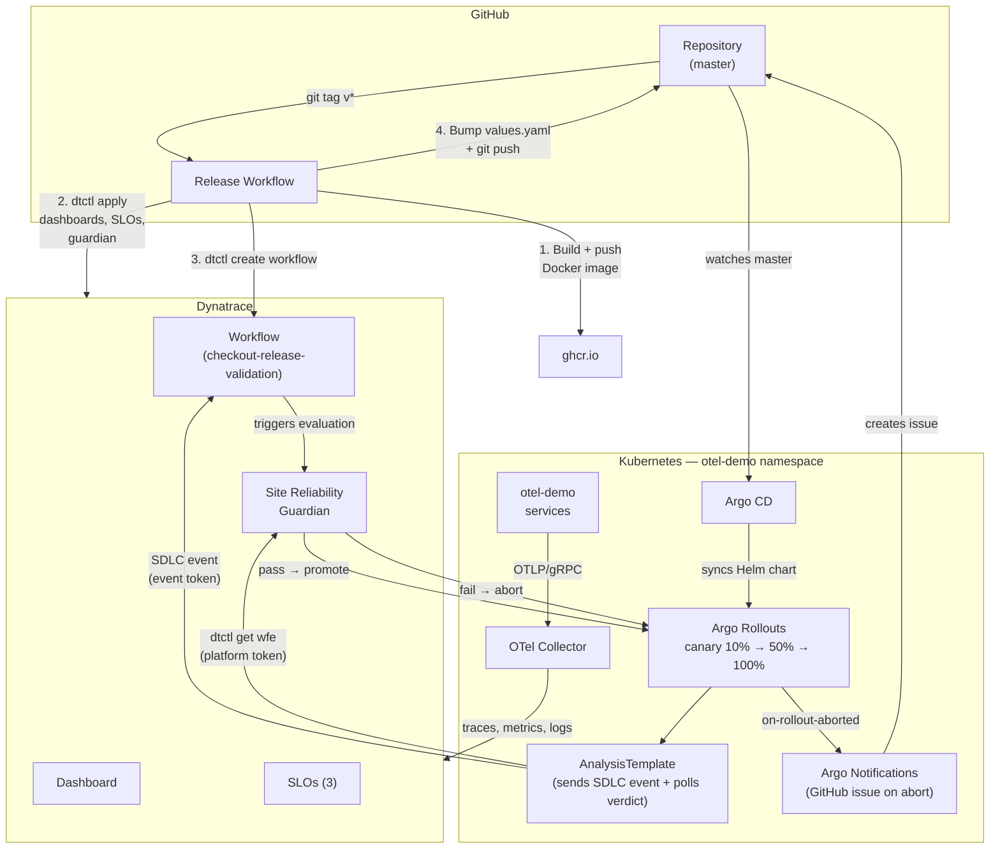

# Observe & Resolve
<p align="center"></p>

## Episode : Dashboards Are Part of Your API
This repository contains the files utilized during the tutorial presented in the dedicated Observe&Resolve episode showing how to ship Dynatrace observability with your application — semantic conventions in Weaver, dashboards / SLOs / Guardians as YAML applied by `dtctl`, GitOps rollouts via Argo CD + Argo Rollouts, and a Site Reliability Guardian gating every release.

This tutorial will utilize:
* OpenTelemetry Operator with the OpenTelemetry Demo application + a single OTel Collector gateway forwarding traces, metrics and logs to Dynatrace
* The Dynatrace Operator (Kubernetes monitoring mode — no OneAgent injection) to populate Smartscape entities for our cluster
* OpenTelemetry **Weaver** to manage the telemetry semantic conventions as code, validated in CI on every pull request
* **dtctl** — the Dynatrace CLI — to apply dashboards, SLOs, workflows, and Site Reliability Guardians as YAML
* **Argo CD** + **Argo Rollouts** to drive a canary rollout of the checkout service on every git tag
* **Site Reliability Guardian** evaluating SLO objectives during the canary, gating promotion or aborting the release
* **Claude Code** with the `henrikrexed/observability-agent-skills` pack for the on-camera code changes
  All the observability data generated by the environment would be sent to Dynatrace.

## Architecture



**Release flow:**
1. Developer pushes a `v*.*.*` tag to GitHub
2. CI builds the checkout Docker image and pushes it to `ghcr.io`
3. CI runs `dtctl apply` to upsert dashboards, SLOs, and the guardian in Dynatrace
4. CI runs `dtctl create workflow` to upsert the guardian-validation workflow
5. CI bumps `deploy/helm/values.yaml` with the new image tag and pushes to master
6. Argo CD detects the values change and syncs the Helm chart to Kubernetes
7. Argo Rollouts starts a canary deployment (10% → 50% → 100%)
8. At each analysis gate, the AnalysisTemplate sends an SDLC event to Dynatrace (using the event token via curl)
9. The `checkout-release-validation` workflow catches the event and triggers the Guardian evaluation
10. The AnalysisTemplate polls `dtctl get wfe` for the workflow execution verdict (using the platform token)
11. Guardian evaluates 3 objectives (availability, p95 latency, latency burn rate) — **pass** promotes, **fail** aborts
12. On abort, Argo Rollouts Notifications auto-creates a GitHub issue for investigation

## Prerequisite
The following tools need to be install on your machine :
- jq
- kubectl
- git
- helm
- gh (GitHub CLI)
- dtctl
- weaver
- kubectl-argo-rollouts
- Claude Code


### 1. Provision a Kubernetes cluster (CAPI)
This episode runs on a small cluster — **2 worker nodes × 4 vCPU / 8 GiB**, Cilium CNI pre-installed by the CAPI template.
```shell
CLUSTERNAME="ep9-demo"
# Use your own CAPI workflow — clusterctl, ArgoCAPI, etc.
# Verify the cluster is healthy:
kubectl get nodes -o wide
kubectl -n kube-system rollout status daemonset cilium --timeout=2m
```

### 2. Clone Github repo

```shell
git clone https://github.com/henrikrexed/observe-resolve-ep9-dtctl
cd observe-resolve-ep9-dtctl
```

## GitHub Secrets

The CI/CD pipelines (`.github/workflows/release.yml`) require the following secrets configured in your GitHub repository under **Settings → Secrets and variables → Actions**:

| Secret | Description | Where to get it |
|---|---|---|
| `DT_PLATFORM_URL` | Your Dynatrace platform (apps) URL (e.g. `https://abc12345.apps.dynatrace.com`) | Dynatrace → browser URL bar (the `.apps.` domain) |
| `DT_PLATFORM_TOKEN` | Platform token used by `dtctl` in CI for applying manifests (dashboards, SLOs, workflows, guardians) | See "Create the Dynatrace tokens" below |

> `GITHUB_TOKEN` is provided automatically by GitHub Actions — no configuration needed. It is used for pushing the Docker image to `ghcr.io` and for committing the `values.yaml` bump back to master.

### Two tokens, two purposes

The system uses **two distinct tokens** because the Dynatrace platform API and the classic ingest API require different authentication:

| Token | Type | Used by | Purpose |
|---|---|---|---|
| **Platform token** (`dt0s16.*`) | Platform | dtctl in CI + AnalysisTemplate Job | Apply manifests, query workflow executions, read task results |
| **Event token** (`dt0c01.*`) | Classic API | AnalysisTemplate Job (curl) | Send SDLC events to trigger Guardian validation |

#### Platform token scopes

Create a platform token (**Settings → Access tokens → Generate new token**, choose Platform token type) with these scopes:

* `automation:workflows:read` / `automation:workflows:write` — query and manage workflow executions
* `settings:objects:read` / `settings:objects:write` — read and write guardians
* `document:documents:read` / `document:documents:write` — manage dashboards
* `storage:events:read` — for DQL queries

#### Event token scopes

Create a classic API token (**Settings → Access tokens → Generate new token**) with these scopes:

* `events.ingest` — send SDLC events
* `openpipeline.events_sdlc` — SDLC event pipeline access
* `bizevents.ingest` — business event ingestion

### Kubernetes secrets (created by deploy.sh)

The deployment script (`demo-app/deploy.sh`) creates these Kubernetes secrets automatically. If you need to recreate them manually:

| Secret | Namespace | Keys | Purpose |
|---|---|---|---|
| `dynatrace` | `default` | `dynatrace_oltp_url`, `dt_api_token`, `clustername` | OTel Collector → Dynatrace ingest |
| `dynakube` | `dynatrace` | operator + data ingest tokens | Dynatrace Operator (K8s monitoring) |
| `dtctl-auth` | `otel-demo` | `DT_API_TOKEN`, `DT_PLATFORM_TOKEN`, `DT_ENVIRONMENT`, `DT_PLATFORM_URL` | AnalysisTemplate → SDLC events + dtctl workflow polling |

The `dtctl-auth` secret carries both tokens: `DT_API_TOKEN` (classic, for SDLC event ingestion via curl) and `DT_PLATFORM_TOKEN` (platform, for `dtctl get wfe` workflow execution queries).

## Getting started


### Dynatrace Tenant
#### 1. Dynatrace Tenant - start a trial
If you don't have any Dynatrace tenant , then I suggest to create a trial using the following link : [Dynatrace Trial](https://dt-url.net/observable-trial)
Once you have your Tenant save the Dynatrace URLs:
```
DT_TENANT_URL=<YOUR TENANT URL>          # e.g. https://abc12345.live.dynatrace.com
DT_PLATFORM_URL=<YOUR PLATFORM URL>      # e.g. https://abc12345.apps.dynatrace.com
```

##### 2. Create the Dynatrace API Tokens
The dynatrace operator and the OpenTelemetry collector will require to have several tokens:
* Token for the Dynatrace operator to deploy and configure the various components (DynaKube)
* Token to ingest metrics, logs, and OpenTelemetry traces into the tenant
* OAuth client to let `dtctl` and the GitHub Actions release pipeline talk to the tenant


###### Operator Token
One for the operator having the following scope:
* Create ActiveGate tokens
* Read entities
* Read Settings
* Write Settings
* Access problem and event feed, metrics and topology
* Read configuration
* Write configuration
* Paas integration - installer downloader
<p align="center"></p>

Save the value of the token . We will use it later to store in a k8S secret
```shell
API_TOKEN=<YOUR TOKEN VALUE>
```
###### Ingest data token
Create a Dynatrace token with the following scope:
* Ingest metrics (metrics.ingest)
* Ingest logs (logs.ingest)
* Ingest events (events.ingest)
* Ingest OpenTelemetry traces (openTelemetryTrace.ingest)
* Read metrics
<p align="center"></p>
Save the value of the token . We will use it later to store in a k8S secret

```shell
DATA_INGEST_TOKEN=<YOUR TOKEN VALUE>
```
###### Platform token (for dtctl + AnalysisTemplate workflow polling)

Create a Dynatrace **platform token** (`dt0s16.*`) in **Settings → Access tokens → Generate new token** (choose Platform token type) with these scopes:

* `automation:workflows:read` / `automation:workflows:write` — query and manage workflow executions
* `settings:objects:read` / `settings:objects:write` — read and write guardians
* `document:documents:read` / `document:documents:write` — manage dashboards
* `storage:events:read` — for DQL queries

This token is used by:
- The GitHub Actions CI pipeline (`release.yml`) for `dtctl apply`
- The AnalysisTemplate Job pod for `dtctl get wfe` (polling workflow execution results)

```shell
DT_PLATFORM_TOKEN=<YOUR PLATFORM TOKEN VALUE>
```

###### Event token (for SDLC event ingestion)

Create a classic **API token** (`dt0c01.*`) with these scopes:

* `events.ingest` — send SDLC events
* `openpipeline.events_sdlc` — SDLC event pipeline access
* `bizevents.ingest` — business event ingestion

This token is used by the AnalysisTemplate Job pod to send SDLC events via curl to the classic API endpoint.

```shell
DT_EVENT_TOKEN=<YOUR EVENT TOKEN VALUE>
```

### Deploy most of the components
The deployment script will deploy the entire environment — cert-manager, OpenTelemetry Operator, Dynatrace Operator + DynaKube (K8s monitoring only), the OTel collector gateway + Instrumentation CR, Argo CD (trimmed), Argo Rollouts + the SRG AnalysisTemplate, the otel-demo-light application, and the Argo CD Application that watches `deploy/helm/values.yaml`:
```shell
chmod 777 demo-app/deploy.sh
./demo-app/deploy.sh \
  --clustername "${CLUSTERNAME}" \
  --dturl "${DT_TENANT_URL}" \
  --dtplatformurl "${DT_PLATFORM_URL}" \
  --dtingesttoken "${DATA_INGEST_TOKEN}" \
  --dtoperatortoken "${API_TOKEN}" \
  --dteventtoken "${DT_EVENT_TOKEN}" \
  --dtplatformtoken "${DT_PLATFORM_TOKEN}"
```

## Apply the baseline dtctl resources

Let's apply the baseline `dtctl` manifests — dashboards, SLOs, workflows, and the Site Reliability Guardian.

First authenticate dtctl against your tenant (interactive browser-based OAuth login):
```shell
dtctl auth login --context my-env --environment "${DT_PLATFORM_URL}"
```

Then apply the baseline:
```shell
make baseline
```

In Dynatrace, open the **Dashboards** application — you should see the `otel-demo · service health` dashboard:
<p align="center"></p>

Open the **Service-Level Objectives** application — three SLOs should appear: `checkout-availability`, `frontend-latency`, `payment-success`:
<p align="center"></p>

Open the **Site Reliability Guardian** — the `checkout-release-guardian` evaluates three objectives (availability, latency, burn rate) on every release:
<p align="center"></p>

## Run the scenarios

Three `make` targets reproduce the on-camera flow end to end. They use `gh` to drive PRs + tags + Argo watching, so make sure `gh auth status` reports OK before running.

```shell
make scenario-1   # GREEN release: feature add → CI green → tag → Argo canary promotes
make scenario-2   # DRIFT: rename pushed → Copilot files ticket → Claude resolves
make scenario-3   # GUARDIAN: regression staged → SRG verdicts fail → Argo aborts
```

`scenario-1` is the dress rehearsal — run it once before recording to make sure the cluster is happy.

## Use Claude Code for the code changes (on camera)

The on-camera code changes are driven by Claude Code wearing four skills: dtctl's own agent skill, Dynatrace-for-AI (the plugin marketplace for reading observability data), `henrikrexed/observability-agent-skills` (the pack for writing correct OpenTelemetry code), and the project-local `skills/observability-repair`.

Install the four skills once on your recording machine:
```shell
dtctl skills install --agent claude
claude plugin marketplace add dynatrace/dynatrace-for-ai
claude plugin install dynatrace@dynatrace-for-ai
npx skills add henrikrexed/observability-agent-skills
```

Then use the three Beat-aligned prompts during recording:

* `prompts/scenario-1-add-cart-size.md` — Beat 1, feature PR adding the `checkout.cart.size` attribute
* `prompts/scenario-2-resolve-drift.md` — Beat 2, resolving the drift ticket Copilot just filed
* `prompts/scenario-3-stage-regression.md` — Beat 3, staging the deliberate regression for the SRG demo

Each prompt file is both the rehearsal doc you read in advance and the paste-source the `claude code --prompt "$(cat ...)"` shell line extracts — one source of truth.

## Watch the episode

YouTube — *Observe & Resolve · Dashboards Are Part of Your API* — [link once published]
